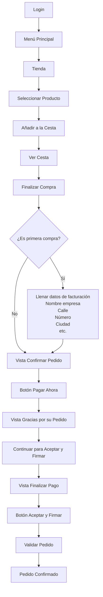

# MicroSaaS - Gestión de Instancias Odoo en Docker

Módulos para Odoo que permiten gestionar instancias Docker de Odoo como un servicio SaaS, integrando la facturación, creación de instancias y suscripciones en un solo flujo automatizado.

---

## 📦 Módulos

### 1. `micro_saas` — Gestión de Instancias Docker

Es el núcleo del sistema. Se encarga de **crear, arrancar, detener y eliminar instancias de Odoo corriendo en contenedores Docker**.

**Responsabilidades:**
- Asignar puertos HTTP y Longpolling disponibles automáticamente
- Generar el archivo `docker-compose.yml` y `odoo.conf` por instancia
- Ejecutar comandos Docker (`up`, `down`, `restart`)
- Activar o pausar la suscripción asociada según el estado de la instancia

**Modelo principal:** `odoo.docker.instance`

**Estados de la instancia:**

| Estado | Descripción |
|--------|-------------|
| `draft` | Recién creada, sin configurar |
| `running` | Contenedor activo |
| `stopped` | Contenedor detenido |
| `error` | Error durante alguna operación |

---

### 2. `crear_instancia_factura` — Facturación → Instancia

Conecta el módulo de facturación nativo de Odoo con el sistema de instancias (Modulo micro_saas). Permite **crear una instancia Docker directamente desde una factura pagada**, prellenando automáticamente los datos del cliente.

**Responsabilidades:**
- Extender `account.move` (facturas) para relacionarlas con instancias
- Validar que la factura sea de cliente y esté completamente pagada antes de crear la instancia
- Redirigir al formulario de creación de instancia con datos prellenados
- Mostrar un contador de instancias por factura
- Permitir navegar a la(s) instancia(s) creadas desde la factura

**Modelo extendido:** `account.move`

---

### 3. `microsaas_subscription` — Suscripciones *(en desarrollo)*

Gestiona el ciclo de vida de las suscripciones asociadas a cada instancia. Se activa automáticamente cuando una instancia pasa a estado `running`.

**Responsabilidades (planeadas):**
- Crear suscripciones en estado `draft` al momento de generar la instancia
- Activar la suscripción con `fecha_inicio = hoy` cuando la instancia arranca
- Controlar fechas de vencimiento mediante un cron job
- Manejar estados: `draft` → `active` → `expiring_soon` → `expired`

**Modelo principal:** `microsaas.subscription`

---

## 🔄 Flujo General del Sistema

```
1. FACTURA PAGADA (account.move)
        │
        │  Usuario hace clic en "Crear Instancia"
        ▼
2. action_crear_instancia()
        │  ✅ Valida: es factura de cliente
        │  ✅ Valida: está pagada (payment_state = 'paid')
        │  ✅ Valida: tiene partner
        │
        │  Redirige al formulario de odoo.docker.instance
        │  Pre-llenando: partner_id, factura_id, name
        ▼
3. FORMULARIO DE INSTANCIA (odoo.docker.instance)
        │  Usuario configura template, repositorios, puertos
        │  (los puertos se asignan automáticos por onchange_name)
        ▼
4. start_instance()
        │  Crea docker-compose.yml
        │  Clona repositorios
        │  Crea odoo.conf
        │  Levanta contenedores
        │  state = 'running'
        ▼
5. _activar_suscripcion()
        │  Busca microsaas.subscription en draft
        │  La activa con fecha_inicio = hoy
        ▼
6. DE VUELTA EN LA FACTURA
        │  instancia_count sube a 1
        │  Botón "Ver Instancias" aparece disponible
        ▼
7. action_ver_instancias()
           Si hay 1 → abre el form directo
           Si hay varias → muestra lista filtrada
```

---

## 🗂️ Estructura del Proyecto

```
addons/
├── micro_saas/                    # Gestión de instancias Docker
│   ├── models/
│   │   └── odoo_docker_instance.py
│   └── ...
├── crear_instancia_factura/       # Relación Factura ↔ Instancia
│   ├── models/
│   │   └── account_move.py
│   └── ...
└── microsaas_subscription/        # Suscripciones (en desarrollo)
    ├── models/
    │   └── microsaas_subscription.py
    └── ...
```

---

## 🔗 Relaciones entre Módulos

```
account.move (Factura)
    │
    │  factura_id (Many2one)
    ▼
odoo.docker.instance (Instancia)
    │
    │  instancia_id (Many2one)
    ▼
microsaas.subscription (Suscripción)
```

- Una **factura** puede generar una o más **instancias**
- Cada **instancia** tiene una **suscripción** asociada que se activa al arrancar

---


## Diagramas de flujo 


## ⚠️ Notas Importantes

- El módulo `microsaas_subscription` debe tener una suscripción en estado `draft` creada y vinculada a la instancia **antes** de ejecutar `start_instance()`, de lo contrario `_activar_suscripcion()` no encontrará nada que activar.
- Los puertos se verifican dos veces: primero contra los ya registrados en la base de datos, luego mediante un `bind` real en el socket del sistema.
- El log de cada instancia se limpia automáticamente si supera los 10,000 caracteres.